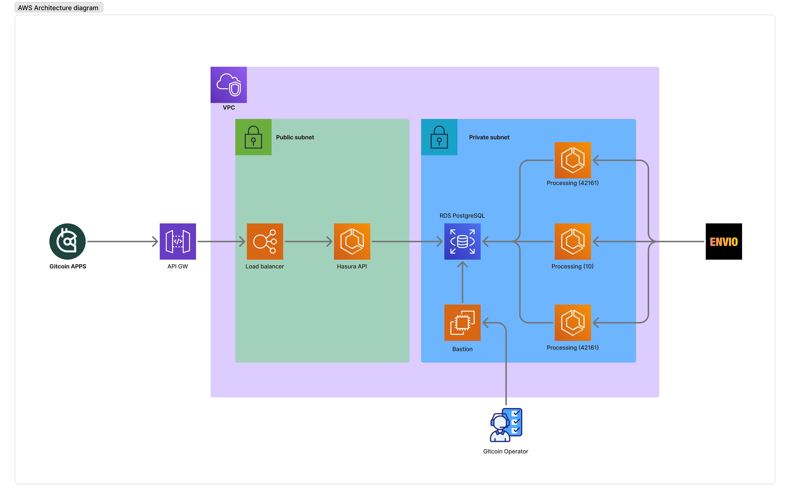

# Production Operations

This guide is for production operations on the Gitcoin Data Layer.

## Architecture diagram



## Prerequisites

-   Make sure you have already created the S3 bucket and ECR repository. Refer to the [README.md](./README.md) for more information.
-   Make sure you have already created environment variables and secrets in the repository settings. Refer to the [README.md](./README.md) for more information.
-   Run `Push Docker Image to ECR` workflow and ensure the latest commit hash is available in the ECR Registry and use that in the TERRAFORM_VARS image tags

## First Deployment

### Steps

1. Run `Deploy to AWS` workflow, and wait until it finishes.
2. Log in to your AWS account
3. Copy your database endpoint from RDS > Databases > gitcoin-data-layer-staging-rds > Connectivity and security > Endpoint
4. Go to EC2 > Instances > gitcoin-data-layer-production-bastion > Connect > Session Manager > Connect ( IF YOU CAN’T USE `SessionManager` try rebooting the instance)
5. Once in the terminal run:

    1. `sudo su`
    2. `cd ~`
    3. `git clone https://github.com/gitcoinco/grants-stack-indexer-v2.git`
    4. `cd grants-stack-indexer-v2`
    5. set env variables for scripts

        1. `nano ./scripts/migrations/.env`

            ```tsx
            DATABASE_URL=postgres://{{DB_USER}}:{{DB_PASSWORD}}@{{DB_URL}}:5432/GitcoinDatalayerGreen
            DATABASE_SCHEMA=public
            NODE_ENV=production
            ```

    6. `chmod +x ./deployment/bastion_scripts/install_dependencies.sh`
    7. `./deployment/bastion_scripts/install_dependencies.sh`
    8. `source ~/.bashrc`
    9. `pnpm i && pnpm build`
    10. `pnpm db:create-databases`

    ### Migrate cache: Run 2 times, first green, blue after.

    1. `nano ./scripts/migrations/.env`

        ```tsx
        DATABASE_URL=postgres://{{DB_USER}}:{{DB_PASSWORD}}@{{DB_URL}}:5432/GitcoinDatalayerGreen
        DATABASE_SCHEMA=public
        NODE_ENV=production
        ```

    2. `pnpm db:cache:migrate`
    3. `nano ./scripts/migrations/.env`

        ```tsx
        DATABASE_URL=postgres://{{DB_USER}}:{{DB_PASSWORD}}@{{DB_URL}}:5432/GitcoinDatalayerBlue
        DATABASE_SCHEMA=public
        NODE_ENV=production
        ```

    4. `pnpm db:cache:migrate`

    ### Bootstrap Green database

    1. `nano ./scripts/bootstrap/.env`

        ```tsx
        NODE_ENV=production
        DATABASE_URL=postgres://{{DB_USER}}:{{DB_PASSWORD}}@{{DB_URL}}:5432/GitcoinDatalayerGreen
        DATABASE_SCHEMA=public
        INDEXER_URL={{INDEXER_URL}}
        PUBLIC_GATEWAY_URLS=[...{{ IPFS_PUBLIC_GATEWAYS}}]
        CHAIN_IDS=[10,1]
        LOG_LEVEL=info
        PRICING_SOURCE=coingecko
        COINGECKO_API_KEY=CG-{{YOUR_COINGECKO_API_KEY}}
        COINGECKO_API_TYPE=pro

        ```

    2. `pnpm bootstrap:metadata`
    3. `pnpm bootstrap:pricing`
    4. `pnpm bootstrap:strategyTimings`

    ### Migrate processing tables: Run 2 times, first green, blue after.

    1. `nano ./scripts/migrations/.env`

        ```tsx
        DATABASE_URL=postgres://{{DB_USER}}:{{DB_PASSWORD}}@{{DB_URL}}:5432/GitcoinDatalayerGreen
        DATABASE_SCHEMA=public
        NODE_ENV=production
        ```

    2. `pnpm db:migrate`
    3. `nano ./scripts/migrations/.env`

        ```tsx
        DATABASE_URL=postgres://{{DB_USER}}:{{DB_PASSWORD}}@{{DB_URL}}:5432/GitcoinDatalayerBlue
        DATABASE_SCHEMA=public
        NODE_ENV=production
        ```

    4. `pnpm db:migrate`

### Configure API

1. `nano ./scripts/hasura-config/.env`

    ```tsx
    HASURA_ENDPOINT={{API_GW_URL}}
    HASURA_ADMIN_SECRET={{YOUR_HASURA_ADMIN_SECRET}}
    HASURA_SCHEMA=public
    ```

2. `pnpm api:configure`

_Note: If data isn't populated, check your processing task logs on ECS. If there are issues, fix them and then run `Upgrade current deployment` workflow. Avoid using this unless you are adding a new chain or there are errors during the first time deployment._

## Upgrade using blue deployment

1. If you made any changes to Envio indexer, you need to wait until the indexer is ready and stable.
2. Update the TERRAFORM_VARS with the new image tag, or changes. (You can run `Current Deployment State` workflow to see the current state of the deployment, and the active environment. If the deployment state is `single`, it means that there is just one deployment and is the active one. If the deployment state is `deployment`, it means that there are two deployments, the blue and the green, and the active environment is `active_deployment`.)
3. Run `Deploy Blue Green (Start upgrade - Step 1)` workflow and deploy the target deployment
4. Follow the instructions to set up the target deployment:

    - Set migrations with target environment `nano ./scripts/migrations/.env`
        ```tsx
        DATABASE_URL=postgres://{{DB_USER}}:{{DB_PASSWORD}}@{{DB_URL}}:5432/GitcoinDatalayer{{Green|Blue(Should be target environment)}}
        DATABASE_SCHEMA=public
        NODE_ENV=production
        ```
    - `pnpm db:reset`
    - `pnpm db:cache:reset`
    - `pnpm db:cache:migrate`
    - `pnpm db:copy-cache -f {{ green | blue (should be the source environment) }}`
    - `pnpm db:migrate`
    - Set hasura config `nano ./scripts/hasura-config/.env`

    ```tsx
        HASURA_ENDPOINT={{PUBLIC_IP_ECS_TASK}}
        HASURA_ADMIN_SECRET={{YOUR_HASURA_ADMIN_SECRET}}
        HASURA_SCHEMA=public
    ```

    - `pnpm api:configure`

5. Wait until the new deployment is stable,you can go to the hasura api task on ECS and get the IP address of the task and check if the api is working. (You can rollback running again using `Promote Blue Green (Start upgrade - Step 2)` workflow)
6. Run `Promote Blue Green (Start upgrade - Step 2)` workflow.
7. Validate that is stable and working .
8. Once you are sure that the new deployment is stable, you can destroy the old deployment by running `Destroy Blue Green (Start upgrade - Step 3)` workflow.

## For New chain

1. Wait for the new chain to be fully indexed on Envio indexer.
2. Update the TERRAFORM_VARS with the new chain in `CHAINS` environment variable.
3. Run `Upgrade current deployment` workflow and deploy it to the current working deployment.

## For new event

1. Wait until envio indexer is ready and stable.
2. Update TERRAFORM_VARS with the new event image tag.
3. Do blue green deployment

## For new strategy

1. Wait until envio indexer is ready and stable.
2. Update TERRAFORM_VARS with the new image tag.
3. Do blue green deployment
